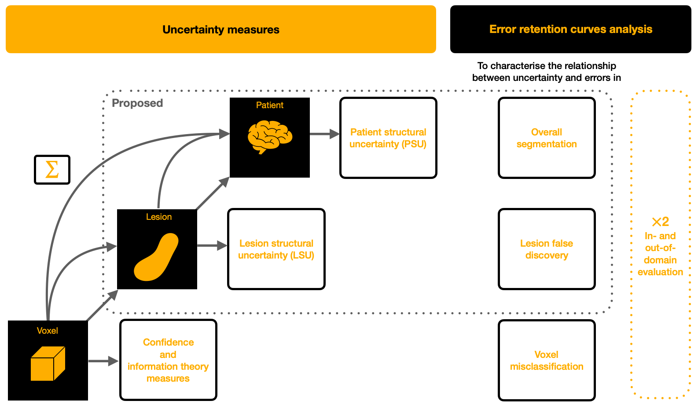

# Uncertainty Measures At Multiple Anatomical Scales: Multiple Sclerosis White Matter Lesion Segmentation



This repository contains the code used for the study of voxel-, lesion-, and patient- scale uncertainty in application to white matter multiple sclerosis segmentation task. For more details, please consult the manuscripts.

The code includes:
* Implementations of voxel-scale uncertainty measures, such as mutual information (MI), expected pair-wise KL divergence (EPKL) and reverse mutual information (RMI) for knowledge uncertainty; expected entropy (ExE) for data uncertainty; entropy of expected (EoE) and negated confidence (NC).
* Implementations of lesion-scale uncertainty measures, such as mean or logsum of voxels' uncertainties within the lesion region, proposed lesion structural uncertainty (LSU and LSU$^{+}$).
* Implementation of the patient-scale uncertainty measures either based on the aggregation from voxel or lesion scales or based on the disagreement in structural predictions (proposed PSU and PSU$^+$).
* Implementation of the retention curves at each of the anatomical scales.

Model
----

The models used in these studies are public benchmarks, including a baseline model from the Shifts 2.0 Challenge ([Shifts project](https://shifts.ai/)) and a nnU-Net architecture trained on the Shifts data splits. The code for model training and inference can be found in the [Shifts GitHub](https://github.com/Shifts-Project/shifts/tree/main/mswml) and [nnU-Net V2 GitHub](https://github.com/MIC-DKFZ/nnUNet). 
We make the model weights available for download at [link](https://drive.google.com/drive/folders/152EyvUIfBLv7RIlW55_kZ4DaA0wM7Pk2?usp=drive_link).

Data
----

The data was also provided by the Shifts project. Already preprocessed data can be downloaded from [zenodo](https://zenodo.org/record/7051658) under the OFSEP data usage agreement. Data is distributed under CC BY NC SA 4.0 license.

The "train" and "dev in" sets were used for training and validation. The "eval in" and "dev out" sets were used for retention curves construction.

Modules description
----

Module "voxel_uncertainty_measures.py" contains implementations of voxel-scale uncertainty measures. Function
`ensemble_uncertainties_classification(probs, epsilon) -> dict` allows obtaining 
all the uncertainty maps for a single scan described in the paper.

Module "lesion_uncertainty_measures.py" contains implementations of lesion-scale uncertainty measures described in the paper. Function 
`lesions_uncertainty(y_pred_multi, vox_unc_maps, ens_pred_multi, ens_pred_multi_true, n_jobs, dl)` allows obtaining
lesion uncertainty measures for each lesion in the scan. Function `lesions_uncertainty_maps(y_pred_multi, vox_unc_maps, ens_pred_multi, ens_pred_multi_true, n_jobs, dl) -> dict` allows obtaining
different lesion uncertainty maps for a particular scan.

Module "patient_uncertainty_measures.py" contains implementations of patient-scale uncertainty measures described in the paper. Function 
`patient_uncertainty(ens_pred_probs: np.ndarray, brain_mask: np.ndarray,ens_prob_thresh: float, mem_prob_threshs: list, subject_lesion_uncs: pd.DataFrame, l_min: int)` computes all uncertainty measures for a single scan.

Module "error_retention_curves.py" contains implementations of voxel- lesion-, and patient- scale retention curves.
Function `voxel_scale_rc(y_pred, y, uncertainties, fracs_retained, metric_name, n_jobs) -> tuple` given uncertainty estimates builds voxel scale retention curve for a chosen segmentation quality metric and computes area above the retention curve for a single scan.
Function `lesion_scale_lppv_rc(tp_les_uncs: list, fp_les_uncs: list, fracs_retained: np.ndarray) -> tuple` given uncertainty values for true positive and false positive lesions builds lesion positive predicted value retention curve for a particular scan.
Function `patient_scale_rc(uncs_sample, metric_sample, replace_with: float = 1.0) -> tuple` given patient uncertainties and performance metrics builds a patient-scale error rc for the whole dataset.

Module "lesion_extraction.py" contains a function to extract TP, FP and FN lesions `get_tp_fp_fn_lesions(...)` given a predicted segmentation map and a ground truth, 
as well as a function to count the number of FN lesions `gt_fn_count(...)`.

Citiation
----

Cite these works in case of using the code.

```bibtex
@misc{molchanova2023structuralbased,
      title={Structural-Based Uncertainty in Deep Learning Across Anatomical Scales: Analysis in White Matter Lesion Segmentation}, 
      author={Nataliia Molchanova and Vatsal Raina and Andrey Malinin and Francesco La Rosa and Adrien Depeursinge and Mark Gales and Cristina Granziera and Henning Muller and Mara Graziani and Meritxell Bach Cuadra},
      year={2023},
      eprint={2311.08931},
      archivePrefix={arXiv},
      primaryClass={cs.CV}
}

@INPROCEEDINGS{10230563,
  author={Molchanova, Nataliia and Raina, Vatsal and Malinin, Andrey and La Rosa, Francesco and Muller, Henning and Gales, Mark and Granziera, Cristina and Graziani, Mara and Cuadra, Meritxell Bach},
  booktitle={2023 IEEE 20th International Symposium on Biomedical Imaging (ISBI)}, 
  title={Novel Structural-Scale Uncertainty Measures and Error Retention Curves: Application to Multiple Sclerosis}, 
  year={2023},
  volume={},
  number={},
  pages={1-5},
  doi={10.1109/ISBI53787.2023.10230563}}
```
